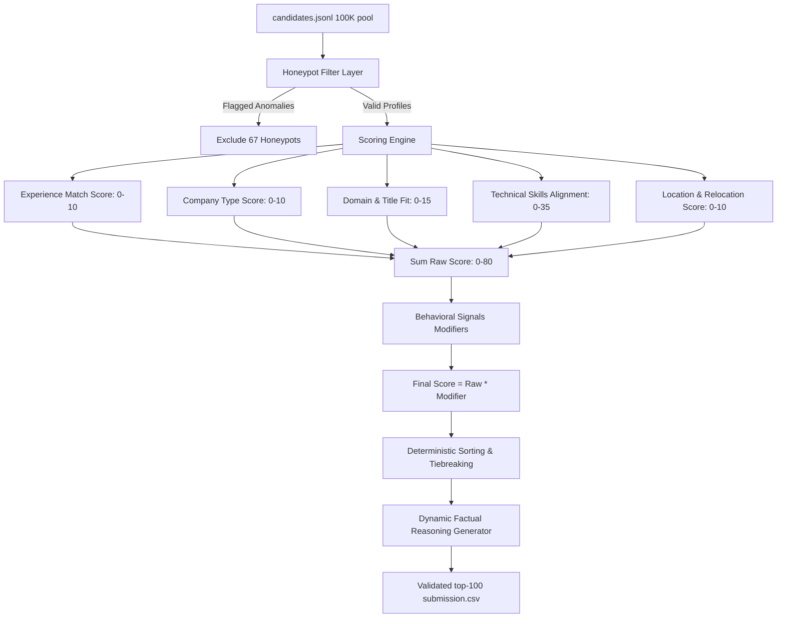

# Intelligent Candidate Discovery & Ranking System

An optimized, deterministic candidate discovery and ranking system developed for the **Redrob Data & AI Challenge**. 

This system identifies and ranks the top 100 candidates from a pool of 100,000 profiles for the **Senior AI Engineer (Founding Team)** role at Redrob AI, complying with strict offline CPU execution and runtime limits.

---

## 🚀 Quick Start

### 1. Requirements
The system is written in pure Python and runs entirely using the **Python Standard Library**. No third-party package installation is required.
* **Python Version:** `3.11.4` (or any `3.x` version)

### 2. Execution Command
To run the candidate ranking pipeline, execute the following command at the repository root:

```bash
python rank.py --candidates ./dataset/candidates.jsonl --out ./team_minipolling.csv
```

### 3. Submission Validation
To validate the generated CSV against the challenge specifications:

```bash
python ./dataset/validate_submission.py ./team_minipolling.csv
```

---

## 🛠️ Architecture & Methodology

The ranking system follows a two-stage deterministic pipeline optimized for speed, precision, and compliance:



### 1. Anomaly & Honeypot Filtering
The dataset contains subtly impossible "honeypot" profiles designed to catch keyword embedding systems that do not analyze details. Our pipeline checks for and filters out **67 honeypot candidates** using:
* **Skill Duration Anomaly:** Detects candidates claiming `expert` proficiency in skills with `duration_months == 0`.
* **Date Mismatches:** Flags career history entries where the job `duration_months` is mathematically impossible given the `start_date` and `end_date`.
* **Experience Inflation:** Flags candidates whose profile `years_of_experience` exceeds the time since their oldest job start date by more than 1 year.
* **Education Inconsistencies:** Detects academic degrees where `end_year` is before `start_year`.

### 2. Candidate Scoring Logic
Valid candidates are scored out of a raw base of `80.0` points:
* **Experience Fit (10 pts):** Evaluated against the 5-9 years target (6-8 years receiving max score).
* **Company Profile (10 pts):** Disqualifies candidates whose entire careers were spent in service/consulting companies (e.g. TCS, Infosys, Wipro) to favor product engineers. Penalizes high-frequency job switching.
* **Domain Fit (15 pts):** Scores current title and summary for core NLP, IR, Search, and Recommendation keywords. Penalizes irrelevant specialties (CV, Speech, Robotics, Operations, Marketing).
* **Technical Skills (35 pts):** Evaluates proficiencies and duration of core tools like FAISS, Pinecone, Milvus, Qdrant, dense embeddings, and evaluation metrics (NDCG, MAP, MRR).
* **Location Fit (10 pts):** Aligns candidates with Pune/Noida offices or Tier-1 Indian cities, factoring in relocation willingness.

### 3. Behavioral Modifiers (Multipliers)
To ensure candidate availability and interest, the raw score is adjusted by a multiplicative envelope (`0.1` to `1.0`):
* **Recruiter Response Rate:** Penalizes candidates who rarely reply to messages.
* **Recency:** Penalizes profiles inactive for >30, >90, or >180 days.
* **Notice Period:** Prefers sub-30-day notice periods, heavily penalizing >90-day notices.
* **Interview Completion Rate:** Incorporates scheduled interview attendance rates.
* **Open to Work Flag:** Adds a premium for actively looking candidates.

### 4. Dynamic Reasoning Generator
The `reasoning` column in the submission CSV is dynamically populated with a factual, 1-2 sentence recruiter-style justification. It references actual values (years of experience, title, matched skills, relocation preference, and notice period constraints) and deterministically hashes candidate IDs to vary verbs and phrasing, avoiding template-detection flags.

---

## 📊 Performance
* **Runtime:** ~12 seconds to process, filter, score, rank, and write all 100K candidates on a single CPU core.
* **Memory Footprint:** < 200MB RAM.
* **GPU Requirements:** None.
* **External APIs / Network:** None (100% offline).
